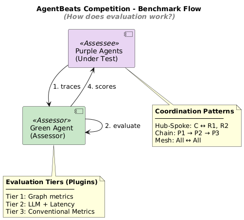

# MAS-GraphJudge

> Measure how, not just whether

A graph-based coordination benchmark where a "Green Agent Judge" dissects
multi-agent interactions into network graphs and evaluates collaboration quality
through structural analysis and LLM assessment.


[](LICENSE.md)
[](https://github.com/qte77/RDI-AgentX-AgentBeats-CompetitionRDI-AgentX-AgentBeats-GraphJudge/actions/workflows/github-code-scanning/codeql)
[](https://www.codefactor.io/repository/github/qte77/RDI-AgentX-AgentBeats-CompetitionRDI-AgentX-AgentBeats-GraphJudge)
[](https://github.com/qte77/RDI-AgentX-AgentBeats-CompetitionRDI-AgentX-AgentBeats-GraphJudge/actions/workflows/ruff.yaml)
[](https://github.com/qte77/RDI-AgentX-AgentBeats-CompetitionRDI-AgentX-AgentBeats-GraphJudge/actions/workflows/pytest.yaml)

## Product Vision

GraphJudge transforms multi-agent interactions into coordination graphs and evaluates
collaboration quality through graph theory, LLM assessment, and performance analysis.

## Novel Value

Graph-based runtime coordination analysis - measuring collaboration quality
through NetworkX metrics and LLM-as-judge evaluation.

## Evaluation Tiers

| Tier | Type      | Description                                   |
| ---- | --------- | --------------------------------------------- |
| 1    | Graph     | NetworkX metrics (centrality, efficiency)     |
| 2    | LLM-Judge | Coordination quality assessment               |
| 3    | Text      | Similarity metrics (plugin for PeerRead)      |

## Architecture



## Submission

### Competition Tracks

- Research Agent
- Multi-Agent
- AAA (Agentified Agent Assessment)

### Abstract

See [docs/GreenAgent-UserStory.md](docs/GreenAgent-UserStory.md) for full problem statement and value proposition.

**TL;DR**: Graph-based structural analysis + LLM-as-judge + text similarity for
multi-tier coordination evaluation. A2A-compliant trace capture enables
reproducible assessment (0% variance) of multi-agent collaboration patterns.

### Demo Video

**Status**: Coming Soon

Demo video (max 3 minutes) will cover: server startup, evaluation flow, and results interpretation.

## Roadmap

- ✅ Phase 1: A2A + Graph + Basic eval (current)
- 🔜 Phase 2 (outlook): ART training on traces, potentially using
  [WeightWatcher](https://github.com/calculatedcontent/weightwatcher) or
  [PerforatedAI](https://github.com/PerforatedAI/PerforatedAI)
- 🔮 Phase 3 (outlook): Self-evolving GreenAgent, e.g.,
  [DGM](https://arxiv.org/abs/2410.04444)

**Note**: Time constraints limited full implementation of advanced features
planned in Phase 2 and 3. Current release focuses on core graph-based
evaluation with proven reproducibility.

## Quick Start

### Run from GHCR (no build needed)

```bash
docker pull ghcr.io/qte77/agentbeats-greenagent:latest
docker run -p 9009:9009 ghcr.io/qte77/agentbeats-greenagent:latest
curl localhost:9009/.well-known/agent.json
```

### Developer Setup

See [docs/AgentBeats/QUICKSTART.md](docs/AgentBeats/QUICKSTART.md) for local development, Docker build, and environment configuration.

## Competition

| Document | Purpose |
|----------|---------|
| [COMPETITION-ALIGNMENT.md](docs/AgentBeats/COMPETITION-ALIGNMENT.md) | Alignment analysis with competition requirements |
| [SUBMISSION-GUIDE.md](docs/AgentBeats/SUBMISSION-GUIDE.md) | Phase 1 submission checklist |
| [LIMITATIONS.md](docs/AgentBeats/LIMITATIONS.md) | Scope boundaries and deferred features |
| [RESOURCES.md](docs/AgentBeats/RESOURCES.md) | External links and references |
